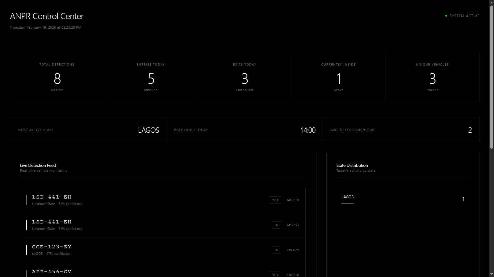

#  Nigerian ANPR System

**Automatic Number Plate Recognition system for Nigerian vehicle registration plates with real-time tracking and web dashboard.**


---

##  Overview

A complete computer vision pipeline that detects, reads, and tracks Nigerian vehicle licence plates from live camera feeds. Features include 36-state recognition, IN/OUT direction tracking, and a responsive web dashboard with real-time analytics.

###  Key Features

- **Real-time Detection**: Live plate recognition from webcam or IP camera
- **Nigerian Format Support**: Validates AAA-000-AA plate format
- **State Recognition**: Identifies all 36 Nigerian states via OCR and fuzzy matching
- **Smart Tracking**: IN/OUT direction with cooldown protection
- **Web Dashboard**: Live monitoring with auto-refresh every 3 seconds
- **Vehicle Analytics**: Detailed per-vehicle dwell time, longest stay, activity timeline
- **Persistent Storage**: SQLite database for all detections
- **Auto-Zoom OCR**: Enhanced state banner detection
- **Smart Backfilling**: Automatic state propagation across matching plate prefixes

---

## ️ Screenshots

### Live Detection

*Real-time plate detection with state recognition and direction tracking*

### Web Dashboard

*Minimalistic black & white dashboard with live stats and vehicle registry*

### Vehicle Details Modal

*Comprehensive analytics per vehicle including total time inside, longest stay, and activity timeline*

---

##  Quick Start

### Prerequisites

- Python 3.9 or later
- Webcam or IP camera
- 4GB RAM minimum (8GB recommended)
- CUDA-compatible GPU (optional, but greatly improves performance)

### Installation

1. **Clone the repository**
   ```bash
   git clone https://github.com/Alpha-dev-001/Nigeria_anpr_python.git
   cd Nigeria_anpr_python
   ```

2. **Install dependencies**
   
   **Windows:**
   ```bash
   start.bat
   ```
   
   **Linux/Mac:**
   ```bash
   pip install -r requirements.txt
   ```

3. **Run the system**
   ```bash
   python launcher.py
   ```

The launcher will:
- Start the detection engine (OpenCV window)
- Start the web dashboard at `http://localhost:5000`
- Automatically open your browser

**Press `q` in the OpenCV window to quit**

---

##  Project Structure

```
Nigeria_anpr_python/
├── anpr_system.py          # Core detection engine
├── web_interface.py        # Flask REST API server
├── dashboard.html          # Web dashboard UI
├── launcher.py             # Unified startup script
├── config.py               # All configuration constants
├── requirements.txt        # Python dependencies
├── start.bat             # Windows installation and start script
├── anpr_database.db        # SQLite database (auto-created)
├── LICENSE                 # License file
├── README.md               # This file
└── docs/
    ├── ANPR_System_Documentation.docx
    └── screenshots/
```

---

## ️ Configuration

All settings are in `config.py`. Key parameters:

### Detection Settings
```python
BLUR_THRESHOLD = 50                # Sharpness threshold
STABILIZATION_TIME = 0.15          # Seconds to wait before OCR
COOLDOWN_SECONDS = 10              # Gap between re-detections
OCR_CONFIDENCE_THRESHOLD = 0.35    # Minimum OCR confidence
```

### Plate Geometry
```python
PLATE_ASPECT_RATIO_MIN = 2.0       # Min width/height ratio
PLATE_ASPECT_RATIO_MAX = 6.0       # Max width/height ratio
PLATE_WIDTH_MIN = 100              # Minimum plate width in pixels
PLATE_AREA_MIN = 3000              # Minimum bounding box area
```

### State Recognition
```python
ENABLE_AUTO_ZOOM = True            # Zoom into state banner
AUTO_ZOOM_SCALE = 2.0              # Magnification factor
AUTO_ZOOM_TOP_PERCENT = 0.35       # Top % of plate to zoom
```

See full documentation for all 40+ configurable parameters.

---

##  Web Dashboard

Access at `http://localhost:5000` after starting the system.

### API Endpoints

| Endpoint | Method | Description |
|----------|--------|-------------|
| `/` | GET | Dashboard HTML |
| `/api/stats` | GET | Aggregate statistics |
| `/api/recent` | GET | Last 20 detections |
| `/api/vehicles` | GET | All tracked vehicles |
| `/api/today` | GET | Hourly stats for today |
| `/api/states/today` | GET | State distribution today |
| `/api/vehicle/<plate>` | GET | Full vehicle analytics |
| `/api/search/<plate>` | GET | Search by plate number |

### Dashboard Features

- **Live Stats**: Total detections, entries, exits, currently inside
- **Quick Analytics**: Most active state, peak hour, avg detections/hour
- **Real-time Feed**: Last 20 detections with state and confidence
- **State Distribution**: Bar chart of top 8 active states
- **Vehicle Registry**: Searchable table of all vehicles
- **Vehicle Details**: Click any vehicle for detailed analytics:
  - Total time inside (all-time)
  - Time inside today
  - Longest stay with date
  - Average stay duration
  - Complete activity timeline

---

##  How It Works

### Detection Pipeline

1. **Frame Capture** - Read from camera via OpenCV
2. **Plate Detection** - Contour analysis finds plate regions
3. **Quality Checks** - Blur and stability filters
4. **Multi-pass OCR** - Three threshold variants with EasyOCR
5. **Plate Validation** - Format check (AAA-000-AA)
6. **State Extraction** - OCR + fuzzy matching + auto-zoom
7. **Cache Lookup** - Check exact plate and prefix cache
8. **Cooldown Check** - Prevent duplicate logging
9. **Direction Assignment** - Alternating IN/OUT per plate
10. **Database Write** - Log to SQLite with state backfilling
11. **Web Update** - REST API serves latest data
12. **Dashboard Refresh** - Auto-updates every 3 seconds

### State Recognition

The system uses 4 fallback mechanisms:

1. **Direct OCR** - Extract state from top banner text
2. **Auto-Zoom** - 2x magnification of top 35% for clearer state text
3. **Exact Cache** - Reuse known state for this exact plate
4. **Prefix Cache** - Use state from other plates with same AAA- prefix

When a new state is discovered, it automatically backfills all matching prefix records in the database.

---

##  Supported States

| State | | State |
|------|-------|
| Lagos | Abuja| Kano |
| Rivers | | Oyo |
| Ogun | | Delta |
| Benue | | Anambra |
| Borno | BAU | Bauchi |
| Jigawa | | Zamfara |
| Sokoto | | Ondo |
| Adamawa | ABI | Abia |
| Edo | | Niger |
| Gombe | | Taraba |
| Yobe | | Kogi |
| Plateau | | Ebonyi |
| Nassarawa |
------------

##  Troubleshooting

### No plates detected
- Lower `PLATE_AREA_MIN` in `config.py`
- Enable `DEBUG_MODE = True` to see detection logs
- Check camera resolution (minimum 720p recommended)

### Wrong state detected
- Ensure `ENABLE_AUTO_ZOOM = True`
- Adjust `AUTO_ZOOM_TOP_PERCENT` (try 0.3 or 0.4)
- Add state variants to `STATE_FUZZY` dictionary

### Dashboard shows 404
- Ensure `dashboard.html` is in the same directory as `web_interface.py`
- Verify Flask is running on port 5000

### Same vehicle logged repeatedly
- Increase `COOLDOWN_SECONDS` to 30 or 60
- Check that direction alternation is working

### Out of memory
- Use CPU mode: `gpu=False` in EasyOCR reader
- Reduce `MAX_PLATES_PER_FRAME` to 1 or 2

---

##  Performance Tips

### Enable GPU Acceleration
Change in `anpr_system.py`:
```python
self.reader = easyocr.Reader(['en'], gpu=True)  # Was gpu=False
```

Requires NVIDIA GPU with CUDA toolkit installed.

### Optimize for Low-End Hardware
```python
# In config.py
MAX_PLATES_PER_FRAME = 1        # Process one plate at a time
COOLDOWN_SECONDS = 30           # Reduce database writes
STABILIZATION_FRAMES = 3        # More stable detections
```

### Expected Throughput
- **CPU only**: 2-3 plates/second
- **With GPU**: 8-15 plates/second

---

##  Documentation

Full technical documentation available in `docs/ANPR_System_Documentation.docx`:
- Complete architecture breakdown
- All 40+ configuration parameters explained
- REST API reference
- Performance tuning guide
- Troubleshooting matrix

---

##  Contributing

Contributions are welcome! Please:

1. Fork the repository
2. Create a feature branch (`git checkout -b feature/AmazingFeature`)
3. Commit your changes (`git commit -m 'Add some AmazingFeature'`)
4. Push to the branch (`git push origin feature/AmazingFeature`)
5. Open a Pull Request

### Areas for Contribution
- [ ] Multi-camera support
- [ ] License plate format validation for other African countries
- [ ] Export reports to PDF/Excel
- [ ] Real-time alerts (email/SMS)
- [ ] Mobile app dashboard
- [ ] Docker containerization
- [ ] Cloud deployment guides (AWS/Azure/GCP)

---

##  License

This project is licensed under the MIT License - see the [LICENSE](LICENSE) file for details.

---

##  Acknowledgments

- **YOLOv8** by Ultralytics for object detection
- **EasyOCR** by JaidedAI for optical character recognition
- **OpenCV** for computer vision operations
- **Flask** for the web framework

---

##  Contact

**Developer**: Alpha-dev-001  
**Repository**: [https://github.com/Alpha-dev-001/Nigeria_anpr_python](https://github.com/Alpha-dev-001/Nigeria_anpr_python)

---

## ️ Disclaimer

This system is intended for educational and research purposes. Ensure compliance with local privacy laws and regulations when deploying in production environments. The developers are not responsible for any misuse of this software.

---
